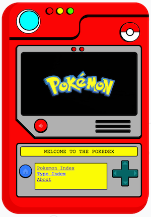
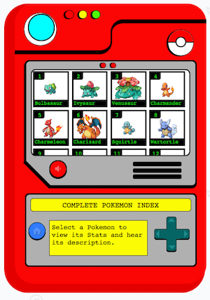
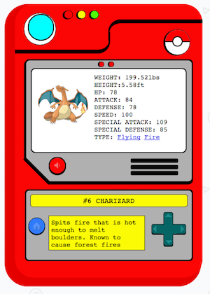

# CSS Pokedex

[View here](pokede.xyz)

### Screenshots






### Background
V1 was built using `Sinatra` + `Postgres`.
I lost those files and built V2 from scratch using `MeteorJS` + `Mongo`.


### Features
* Text-to-Speech for each Pokemon's page
* Interactive Buttons
* Toggleable Pokemon Theme Song

### Credit
* [Pokéapi](http://pokeapi.co/) for stats
* [Pokestadium](http://www.pokestadium.com/) for sprites
* [Pokemon.com](http://www.pokemon.com/) for show images
* [mattytemple/speak-js](https://github.com/mattytemple/speak-js) for TTS


To Download sprites from [Pokestadium](http://www.pokestadium.com/) to local repo:
```
for i in {1..151}; do
  curl -o /destination/path/$i.png http://www.pokestadium.com/assets/img/sprites/$i.png
done
```


Copyright © 2016

Distributed under the [Creative Commons Attribution-NonCommercial-ShareAlike 4.0 International License](https://creativecommons.org/licenses/by-nc-sa/4.0/legalcode).
